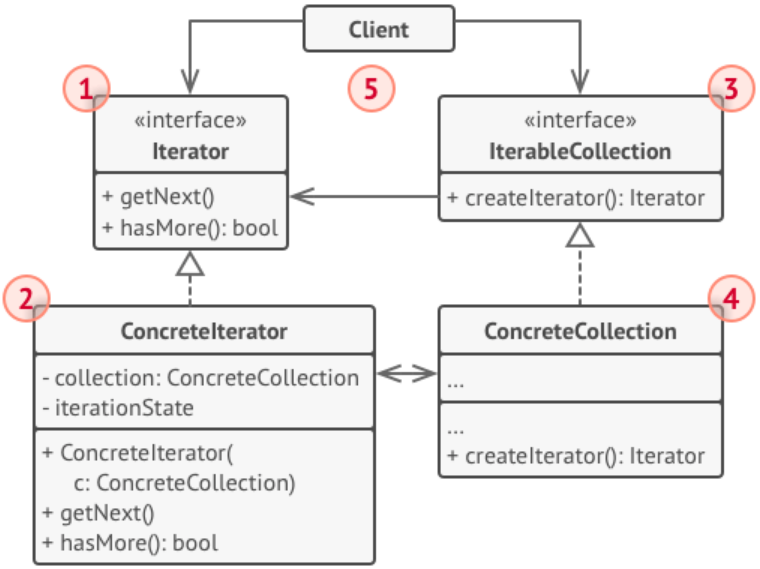

# Абстрактные классы и интерфейсы 

7.3. Итератор по массиву

Задача
--------

Написать итератор по массиву. 
Итератор — это объект, который позволяет поочередно получать элементы из коллекции.

Решение:
--------

    class ArrayIterator<T> implements Iterator<T>{

        private T[] array;
        private int index = 0;
    
        public ArrayIterator(T[] array) {
            this.array = array;
        }
    
        @Override
        public boolean hasNext() {
            return index < array.length;
        }
    
        @Override
        public T next() {
            if(!hasNext())
                throw new NoSuchElementException();
            return array[index++];
        }
    }
